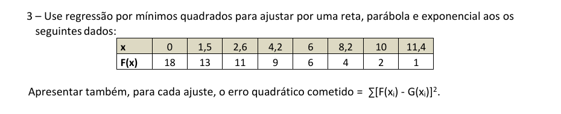

# Questão 3: Interpolação Polinomial/Mínimos Quadrados

## Descrição

Este repositório contém a solução da **Questão 3** do trabalho, focada em **Interpolação Polinomial** e **Mínimos Quadrados**. Nesta questão, utilizamos o método dos mínimos quadrados para ajustar diferentes modelos (reta, parábola e exponencial) aos dados fornecidos.

O objetivo desta questão é encontrar a melhor representação dos dados por meio de três ajustes diferentes:

- **Ajuste Linear**
- **Ajuste Quadrático**
- **Ajuste Exponencial**

Além disso, calculamos o **erro quadrático** de cada ajuste para determinar qual modelo é mais apropriado.

### Imagem da Questão



## Estrutura do Projeto

- **`src/`**: Código-fonte da solução em Python.
  - `main.py`: Arquivo principal contendo a implementação dos ajustes e a visualização gráfica dos dados.
- **`docs/`**: Documentos de apoio, incluindo a imagem da questão.
  - `Questao3.png`: Imagem fornecida que descreve a questão.

## Requisitos

Antes de executar o projeto, certifique-se de ter instalado:

- **Python 3.x**
- Bibliotecas Python:
  - `numpy`
  - `matplotlib`

Você pode instalar as bibliotecas necessárias usando o `pip`:

```bash
pip install numpy matplotlib
```

## Como Rodar o Projeto

Para executar o código da solução, siga os passos abaixo:

1. **Clone este repositório:**

   ```bash
   https://github.com/Wanjos-eng/CalculoNumerico_MinimosQuadrados.git
   ```

2. **Navegue até o diretório do projeto:**

   ```bash
   cd nome-do-repositorio
   ```

3. **Instale as dependências necessárias:**

   ```bash
   pip install numpy matplotlib
   ```

4. **Execute o script principal:**

   ```bash
   python src/main.py
   ```

   Isso irá executar o programa que realiza os ajustes linear, quadrático e exponencial nos dados fornecidos, exibindo os gráficos correspondentes e os erros quadráticos calculados para cada ajuste.

## Resultados

Ao finalizar a execução, serão exibidos gráficos comparativos dos diferentes modelos ajustados aos dados, além dos valores dos erros quadráticos para cada um. Isso ajudará a determinar qual modelo oferece o melhor ajuste aos dados fornecidos.
